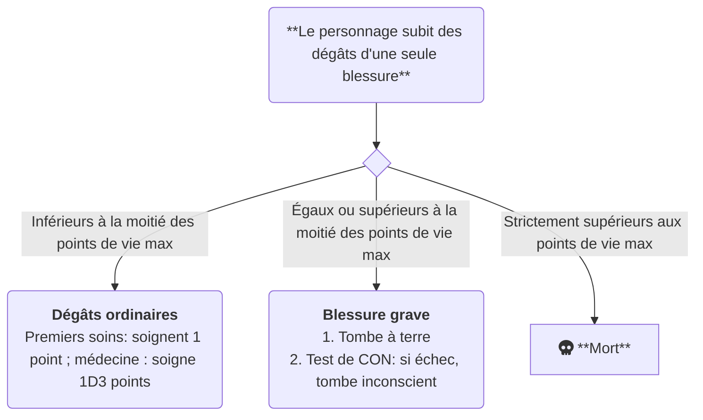
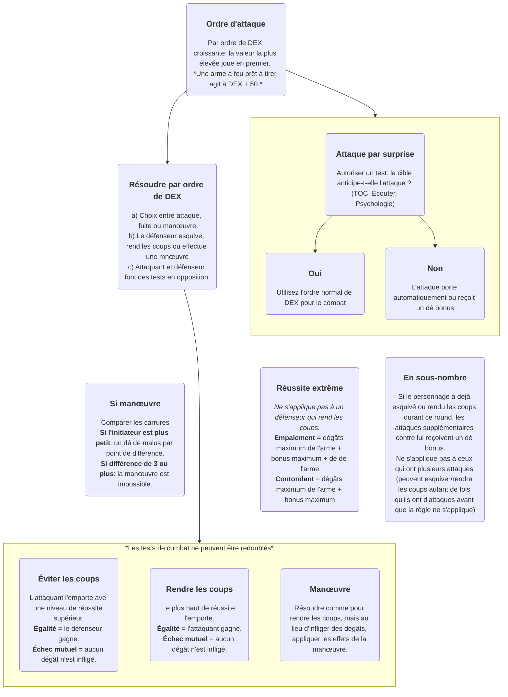

# Appel de cthulhu - aide mémoire

## Système de jeu

1D100 ; la plupart des actions se résolvent à l’aide d’un `D100` (un `D10` + un `D10aines`).

> 00 = 100

Exemple : pour une compétence à 45 %, un `D100` faisant 45 ou moins est réussi.

En combat, l’avantage est à la défense : si l’assaillant et le défenseur font la même qualité de réussite, le défenseur réussit sa défense.

## Qualités de réussite

| D100             | Qualité de réussite                                                 |
| ---------------- | ------------------------------------------------------------------- |
| 01               | Réussite critique. Un jet d'expérience immédiat dans la compétence. |
| ≤ compétence ÷ 5 | Réussite extrême                                                    |
| ≤ compétence ÷ 2 | Réussite majeure                                                    |
| ≤ compétence     | Réussite standard                                                   |
| > compétence     | Échec                                                               |
| 96-100           | Échec critique « fumble »                                           |

### Exemple, pour une compétence à 70 %

| D100   | Qualité de réussite |
| ------ | ------------------- |
| 01     | Réussite critique   |
| 02-14  | Réussite extrême    |
| 15-35  | Réussite majeure    |
| 36-70  | Réussite standard   |
| 71-95  | Échec               |
| 96-100 | Échec critique      |

## Redoublement

Il est possible de redoubler un jet (i.e. relancer le D100), mais avec une justification _roleplay_ (sauf pour le combat et la SAN, qu’il n’est pas possible de redoubler)

### Exemples de justifications

| Compétence     | Justification                                                      |
| -------------- | ------------------------------------------------------------------ |
| Arts & métiers | Recommencer l'œuvre depuis le début                                |
| Baratin        | Se rapprocher pour établir une connection physique                 |
| Conduite       | Faire demi-tour, prendre une autre route                           |
| Discrétion     | Retirer ses chaussures, faire diversion                            |
| Intimidation   | Se lever, se rapprocher, parler plus fort                          |
| Persuasion     | Se rapprocher, poser une question personnelle, toucher la personne |

## Dés de bonus et de malus

Lorsqu’une action est particulièrement facile à accomplir, le gardien pourra donner des dés de bonus.

Fonctionnement : pour chaque dé de bonus, lancer un dé de dizaines supplémentaires.

Avec 1 dé de bonus pour un test de compétence, le joueur lance un D10 et deux D10aines. Il sélectionne le jet le plus favorable pour la réussite de l’action.

Les dés de malus s’utilisent de la même manière, mais cette fois le joueur sélectionnera le jet le plus défavorable pour la réussite de l’action.

### Exemples d'usage

| D10aines 1 | D10aines 2 | D10 | Si dé bonus | Si dé malus |
| ---------- | ---------- | --- | ----------- | ----------- |
| 40         | 80         | 4   | 44          | 84          |
| 00         | 20         | 5   | 05          | 25          |
| 60         | 00         | 0   | 60          | 100         |
| 20         | 00         | 0   | 20          | 100         |

## Expérience

Un jet d’expérience est un jet raté de compétence. Exemple : pour une compétence à 45 %, un D100 faisant plus de 46 est un jet d’expérience réussi.

> Plus l'investigateur progresse dans une compétence, plus il lui est difficile de progresser.

Un jet d'expérience réussi confère `1d8 + 2` points dans cette compétence. S'il est raté, il confère `1d3` points.

### Dépense des points d’expérience

Cette table décrit combien investir de points d'expérience dans une compétence pour pouvoir faire un jet d'expérience.

| Score de compétence | Coût |
| ------------------- | ---- |
| 0-24                | 1 XP |
| 25-49               | 2 XP |
| 50-74               | 3 XP |
| 75-99               | 4 XP |

## Récompenses

## Blessures et soins

### Guérison des blessures graves

**Test de récupération à la fin de chaque semaine.**

- Échec: pas de guérison
- Succès: récupère 1D3 points.
- Succès extrême: récupère 2D3 points et efface la blessure grave.

---

- Dé bonus si soigné correctement (test de Médecine)
- Dé bonus si le patient se repose ou est dans un environnement adéquat
- Dé malus si mauvaises conditions

## Le combat

