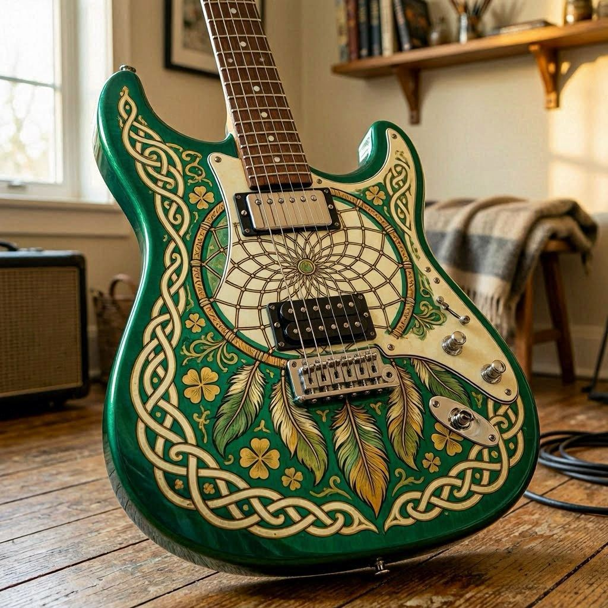
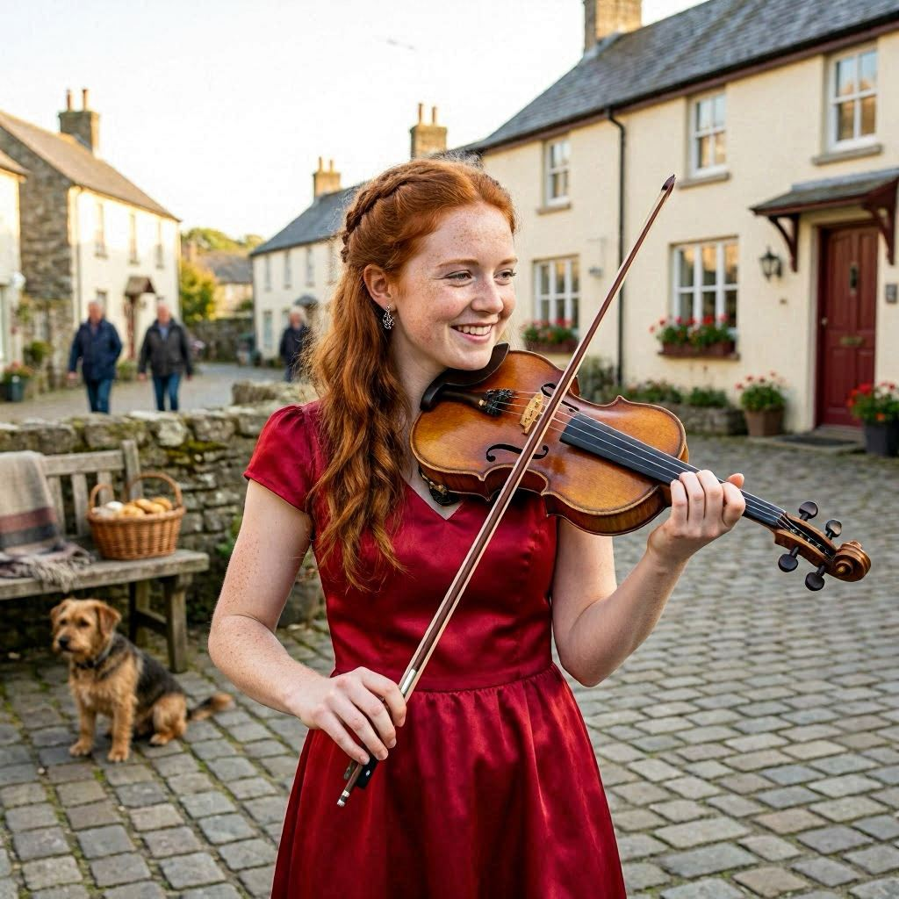

# Kellen O’Clover

|        |                              |
|--------|------------------------------|
| Cour   | Seelies                      |
| Aspect | Gamin                        |
| Kith   | Clurichaun                   |
| Bande  | Maisonnée `l'hôtel du seuil` |

## Historiques

| Historique           | Niveau |
|----------------------|--------|
| Compagnon chimérique | ⚫⚫⚫⚪⚪  |
| Possessions (groupe) | ⚫⚫⚫⚫⚫  |
| Réminiscence         | ⚫⚫⚫⚪⚪  |
| Ressources (groupe)  | ⚫⚫⚫⚫⚫  |
| Rêveurs              | ⚫⚫⚫⚪⚪  |
| Trésors              | ⚫⚪⚪⚪⚪  |

### Compagnon chimérique: Morrig, un corbeau

| Attributs physiques | Score | Attributs sociaux   | Score | Attributs mentaux     | Score |
|---------------------|-------|---------------------|-------|-----------------------|-------|
| Force               | ⚫⚪⚪⚪⚪ | Charisme [éloquent] | ⚫⚫⚫⚫⚪ | Perception            | ⚫⚫⚫⚪⚪ |
| Dextérité           | ⚫⚪⚪⚪⚪ | Manipulation        | ⚪⚪⚪⚪⚪ | Intelligence [érudit] | ⚫⚫⚫⚫⚫ |
| Vigueur             | ⚫⚪⚪⚪⚪ | Apparence           | ⚫⚫⚪⚪⚪ | Astuce                | ⚫⚪⚪⚪⚪ |

| Talents    | Score | Compétences            | Score | Connaissances                | Score |
|------------|-------|------------------------|-------|------------------------------|-------|
| Acuité     | ⚫⚪⚪⚪⚪ | Représentation [chant] | ⚫⚫⚪⚪⚪ | Énigmes                      | ⚫⚫⚫⚫⚪ |
| Expression | ⚫⚪⚪⚪⚪ | Étiquette              |       | Érudition [théorie musicale] | ⚫⚫⚪⚪⚪ |
|            |       |                        |       | Gremayre                     | ⚫⚫⚪⚪⚪ |

| Volonté    | Glamour    |
|------------|------------|
| ⚫⚫⚫⚫⚫⚪⚪⚪⚪⚪ | ⚫⚫⚫⚫⚫⚫⚪⚪⚪⚪ |

#### Fable

- guérison (5 pts)
- vol (3 pts)
- wyrd (7 pts)

### Rêveurs

- Matt Kelly, batteur
- Tim Brennan, accordéoniste
- Kevin Rheault, bassiste
- Campbell Webster, cornemuse

### Trésors

#### Dreamcatcher

## Arts

| Art           | Niveau |
|---------------|--------|
| Désignation   | ⚫⚪⚪⚪⚪  |
| Ire du dragon | ⚫⚪⚪⚪⚪  |
| Oniromancie   | ⚫⚪⚪⚪⚪  |
| Saga          | ⚫⚪⚪⚪⚪  |

### Désignation

#### 🪙 Entre les lignes

##### Système

Le Royaume invoqué indique la source du message.
L’Accessoire servira à lire un livre rédigé dans un code. L’Acteur aidera le personnage à comprendre un interlocuteur qui s’exprime dans une langue étrangère.
La Nature lui permettra de saisir les messages diffusés par le chant des oiseaux, et la Fée de déchiffrer les énigmes posées par d’anciennes chimères.
Le nombre de réussites importe peu quand il s’agit de comprendre un message codé ou une langue étrangère écrits.
Cependant, chaque réussite ajoute un dé au groupement des actions en opposition entreprises pour découvrir la vérité ou percer à jour les mensonges durant la scène en cours.

##### Type

Chimérique

### Ire du dragon

#### 🪙 Muscles brûlants

##### Système

Le Royaume invoqué détermine la cible de l’enchantement.
Le sortilège augmente le score de Force d’une créature vivante et s’il s’agit d’un objet, toutes les attaques portées avec celui-ci infligent des dés de dégâts supplémentaires.
Les réussites obtenues sur le jet d’activation du charme doivent être réparties entre son efficacité et sa durée. Chaque réussite affectée à l’efficacité ajoute un point de Force ou un dé de dégâts.
Chaque réussite consacrée à la durée prolonge ses effets d’un tour et si le personnage n’en a pas désigné, le sortilège ne dure qu’un seul tour.

##### Type

Chimérique

### Oniromancie

#### 🪙 Marche onirique

##### Système

Le charme peut servir à entrer dans le songe d’une créature assoupie si le changelin connaît le Royaume correspondant.
Dans ce cas, l’Oniromancien n’emporte rien avec lui. Il réapparaîtra à l’endroit où il a lancé son sortilège lorsqu’il décidera d’en ressortir, ou bien quand le dormeur se réveillera. Un personnage doit pouvoir voir sa cible la première fois qu’il utilise la Marche onirique sur elle.
Cependant, son joueur devra dépenser un point de Volonté afin d’établir un lien, et cela permettra ensuite au changelin d’entrer à nouveau dans ses rêves à n’importe quel moment dans le futur. La cible se rappellera le songe quand elle s’éveillera. Ainsi, le charme est une façon efficace de transmettre des messages et des avertissements.
Il faut d’abord réussir à lancer la Marche onirique avant d’utiliser tous les autres charmes de l’Oniromancie.

##### Type

Wyrd

### Saga

#### 🪙

##### Système

##### Type

## Autres traits / héritages

`Délectation` : en général, les Clurichauns récoltent leur Glamour auprès de confrères collectionneurs.
Ils savourent le sentiment de réussite qu’un conservateur éprouve à rassembler une collection de belles statues de verre, la satisfaction d’un bibliophile lorsqu’il finit par trouver le livre rare qu’il cherche depuis si longtemps, ou la joie d’un enfant quand il déballe la seule carte qui manquait à son jeu à collectionner.
Bien sûr, ils peuvent aussi glaner le Glamour pendant une bonne bagarre.

`Déchaînement` : les charmes lancés par les Clurichauns laissent dans leur sillage la douce odeur de l’herbe et le mordant du whisky. L’air prend une vive teinte verte et il est arrivé que des trèfles poussent spontanément dans les empreintes d’un de ces changelins.
Les personnes présentes peuvent ressentir une brusque euphorie, ou bien la sensation d’avoir entendu une blague désopilante à peine quelques instants auparavant.
Elles se prennent parfois même à rire sans savoir pourquoi.

`Clin d’œil` : on le voit, et puis on ne le voit plus.
Détournez un instant les yeux et le Clurichaun se fondra dans le décor, complètement indétectable.
À moins d’être attaché avec des liens de fer froid, il s’évanouira en un battement de cil même si on le tient physiquement.
Il réapparaîtra dans la zone, mais hors de la vue d’un éventuel observateur ou de son ravisseur. Si quelqu’un le touche, si on le ligote ou si on l’entrave d’une manière ou d’une autre, il devra dépenser un point de Glamour pour disparaître.

`Provocations verbales` : en quelques instants à peine, un Clurichaun peut déchiffrer une personne ou un groupe et savoir exactement quoi dire pour déclencher un combat.
Pour lui, rien de mieux pour briser la glace et se faire de vrais copains qu’un bon festival de mornifles.
Il est capable d’inciter n’importe qui à donner le premier coup de poing.
Sa cible y résistera si elle réussit un jet de Volonté (difficulté 8).
Cet Héritage peut servir à déclencher une bagarre entre le Kithain et elle, ou entre celle-ci et une autre personne.

## Fragilité

`Collectionnite`: pour les Clurichauns, collectionner n’est pas qu’un simple passe-temps, c’est une obsession qui les ronge.
Ils doivent passer un certain temps au milieu de leurs objets pour satisfaire cet Aspect de leur nature.
Voilà une tâche aisée pour un changelin avec une collection réduite et transportable, et bien moins facile avec un ensemble d’objets plus important et encombrant.
Passer plus d’une semaine loin de sa collection amorce la Banalité chez les Clurichauns.

## Atouts & handicaps

| Nom                    | Coût                | Description                                                                                                                                                                                                                                                                                                                                                                                                                                                                                                                                                                          |
|------------------------|---------------------|--------------------------------------------------------------------------------------------------------------------------------------------------------------------------------------------------------------------------------------------------------------------------------------------------------------------------------------------------------------------------------------------------------------------------------------------------------------------------------------------------------------------------------------------------------------------------------------|
| Résistance aux poisons | atout ; 1 point     | Vous avez une résistance naturelle ou vous avez développé vos défenses contre tous les types de poisons connus. La difficulté de tous vos jets d’absorption contre les effets d’un poison ou d’une toxine diminue de –3.                                                                                                                                                                                                                                                                                                                                                             |
| Visage amical          | atout ; 1 point     | Votre visage inspire la confiance aux gens. L’effet ne disparaît pas si vous expliquez l’erreur, et la difficulté de tous les jets sociaux appropriés (par exemple, pour les premières impressions, mais pas pour l’intimidation) impliquant un inconnu diminue de –2. Cet atout ne fonctionne qu’à la première rencontre                                                                                                                                                                                                                                                            |
| Oreille attentive      | atout ; 1 point     | Les Pookas savent y faire quand il s’agit de faire parler les gens. Cependant, vous êtes un maître en la matière. Un mot par ci, un geste par là et vous ouvrez les gens comme des huîtres, vous récoltez leurs secrets comme autant de perles. Face à votre aptitude à écouter, les autres vous dévoilent leurs sentiments, leurs problèmes et leurs rêves secrets. Ils ne savent pas pourquoi ils vous racontent tout ça, mais ils se sentent en général mieux après. La difficulté de tous les jets visant à obtenir des informations des autres diminue de –2                    |
| Peau de granit         | atout ; 2 points    | Cet atout, très courant parmi les Trolls et les Bonnets rouges, est assez littéral. Votre épiderme est recouvert d’une fine couche de pierre très dure, qui le rend beaucoup plus résistant que la normale. Vous avez quand même la fâcheuse tendance à semer derrière vous de petits éclats dès que vous vous penchez ou que vous vous pliez. Vous êtes en permanence protégé par l’équivalent d’une cotte de mailles (cf. page 285). Si elle n’impose aucune pénalité à la Dextérité, la difficulté de tous les jets effectués pour se déplacer sans faire de bruit augmente de +1 |
| Voix de rossignol      | atout ; 2 points    | Les Satyres disent que votre voix pourrait charmer les pommes sur les arbres. Vous avez l’oreille absolue et vous êtes capables de chanter a cappella sans erreur ni fausse note. Même lorsque vous ne faites que parler, votre voix séduit et attire les gens. La difficulté des jets en rapport avec l’éloquence ou le chant diminue de –2                                                                                                                                                                                                                                         |
| Volonté de fer         | atout ; 3 points    | Vos détracteurs prétendent que vous êtes têtu comme une mule. En réalité, c’est grâce à cette détermination et à cette obstination que vous ne vous détournez jamais du but que vous vous êtes fixé. La difficulté de toutes les tentatives qui visent à utiliser contre vous une magie altérant l’esprit augmente de +3 (maximum 9). Cet atout n’affecte pas les pouvoirs en rapport avec les émotions et les personnages dont le score de Volonté est inférieur à 5 ne peuvent pas le choisir.                                                                                     |
| Coléreux               | handicap ; 2 points | Vous distribuez des coups à la moindre provocation à votre encontre ou l’un de vos proches compagnons. Quand on vous incite à réagir de la sorte, vous devez faire un jet de Volonté pour vous maîtriser (difficulté à l’appréciation du conteur selon la gravité de l’insulte)                                                                                                                                                                                                                                                                                                      |
| Geis                   | handicap ; 2 points | Ne jamais boire seul. S’il n’y a personne, il faut trouver quelqu'un, fût-ce un ennemi capturé ou un esprit. Ne jamais non plus laisser quelqu'un boire seul dans la tristesse.                                                                                                                                                                                                                                                                                                                                                                                                      |
| Pupille                | handicap ; 3 points | Vous vous dévouez à la protection d’un mortel ou d’un Kinain, peut-être un ami ou un membre de votre famille que vous avez connu avant votre Chrysalide. Les pupilles ont le don de se retrouver mêlées aux événements des scénarios et de vous mettre autant dans les ennuis que dans les situations dangereuses. Décrivez ce personnage à votre conteur avant le début de la chronique                                                                                                                                                                                             |

### Pupille: Maeve

