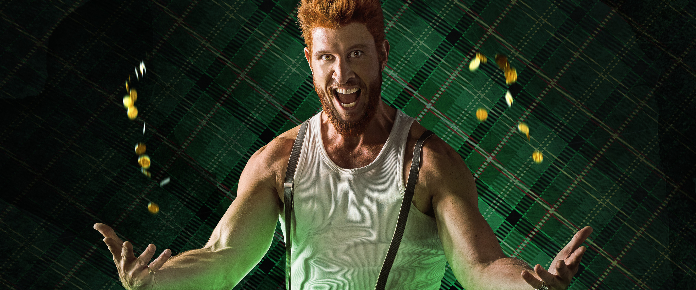
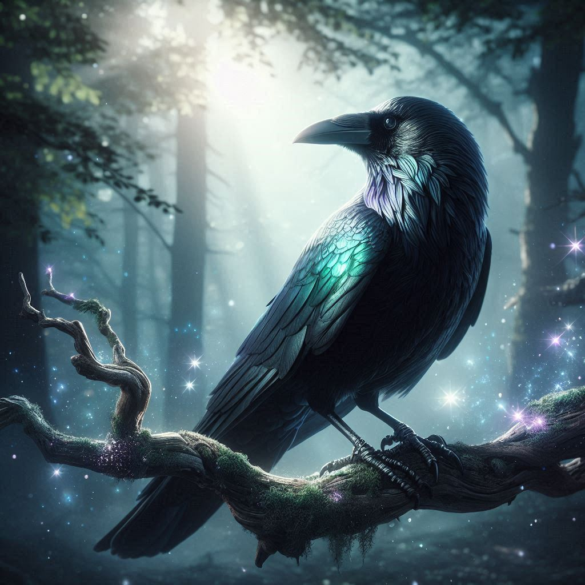

# Kellen O’Clover

|        |                 |
|--------|-----------------|
| Cour   | Seelies         |
| Aspect | Gamin           |
| Kith   | Clurichaun      |
| Bande  | Maisonnée `xxx` |

## Historiques

| Historique           | Niveau |
|----------------------|--------|
| Possessions          | ⚫⚫⚫⚫⚫  |
| Ressources           | ⚫⚫⚫⚫⚫  |
| Rêveurs              | ⚫⚫⚫⚪⚪  |
| Réminiscence         | ⚫⚫⚫⚪⚪  |
| Compagnon chimérique | ⚫⚫⚫⚪⚪  |

### Compagnon chimérique: Morrig, un corbeau

## Arts

| Art           | Niveau |
|---------------|--------|
| Ire du dragon | ⚫⚪⚪⚪⚪  |
| Oniromancie   | ⚫⚪⚪⚪⚪  |
| Désignation   | ⚫⚪⚪⚪⚪  |

## Autres traits / héritages

`Délectation` : en général, les Clurichauns récoltent leur Glamour
auprès de confrères collectionneurs. Ils savourent le sentiment de
réussite qu’un conservateur éprouve à rassembler une collection
de belles statues de verre, la satisfaction d’un bibliophile lorsqu’il
finit par trouver le livre rare qu’il cherche depuis si longtemps, ou la
joie d’un enfant quand il déballe la seule carte qui manquait à son
jeu à collectionner. Bien sûr, ils peuvent aussi glaner le Glamour
pendant une bonne bagarre.

`Déchaînement` : les charmes lancés par les Clurichauns laissent dans
leur sillage la douce odeur de l’herbe et le mordant du whisky. L’air
prend une vive teinte verte et il est arrivé que des trèfles poussent
spontanément dans les empreintes d’un de ces changelins. Les
personnes présentes peuvent ressentir une brusque euphorie, ou
bien la sensation d’avoir entendu une blague désopilante à peine
quelques instants auparavant. Elles se prennent parfois même à
rire sans savoir pourquoi.

`Clin d’œil` : on le voit, et puis on ne le voit plus. Détournez un instant les
yeux et le Clurichaun se fondra dans le décor, complètement indétec-
table. À moins d’être attaché avec des liens de fer froid, il s’évanouira en
un battement de cil même si on le tient physiquement. Il réapparaîtra
dans la zone, mais hors de la vue d’un éventuel observateur ou de
son ravisseur. Si quelqu’un le touche, si on le ligote ou si on l’entrave
d’une manière ou d’une autre, il devra dépenser un point de Glamour
pour disparaître.

`Provocations verbales` : en quelques instants à peine, un Clurichaun
peut déchiffrer une personne ou un groupe et savoir exactement quoi
dire pour déclencher un combat. Pour lui, rien de mieux pour briser
la glace et se faire de vrais copains qu’un bon festival de mornifles. Il
est capable d’inciter n’importe qui à donner le premier coup de poing.
Sa cible y résistera si elle réussit un jet de Volonté (difficulté 8). Cet
Héritage peut servir à déclencher une bagarre entre le Kithain et elle,
ou entre celle-ci et une autre personne.

## Fragilité

`Collectionnite`: pour les Clurichauns, collectionner n’est pas qu’un
simple passe-temps, c’est une obsession qui les ronge. Ils doivent
passer un certain temps au milieu de leurs objets pour satisfaire
cet Aspect de leur nature. Voilà une tâche aisée pour un changelin
avec une collection réduite et transportable, et bien moins facile
avec un ensemble d’objets plus important et encombrant. Passer
plus d’une semaine loin de sa collection amorce la Banalité chez
les Clurichauns.

## Atouts & handicaps

| Nom | Coût | Description |
|-----------------------------|-------|------------------------------------------------------------------------------------------------------------------------------------------------------------------------------------------------------------------------------------------------------------------------------------------------------------------------------------------------------------------------------------------------------------------------------------------------------------------------------------------------------------------------------------------------------------------------------------------------------------------------------------------------------------------------------------------------------------------------------------------------------------------------------------------------------------------------------------------------------------------------------------------------------------------------------------------------------------------------------------------------------------------------------------------------------------------------------------------------------------------------------------------------------------------------------------------------------------------------------------------------------------------------------------------------------------------------------------------------------------------------------------------------------------------------------------------------------------------------------------------------------------------------------------------------------------------------------------------------------------------------------------|
| résistance aux poisons | atout ; 1 point | Vous avez une résistance naturelle ou vous avez développé vos défenses contre tous les types de poisons connus. La difficulté de tous vos jets d’absorption contre les effets d’un poison ou d’une toxine diminue de –3.
| visage amical | atout ; 1 point | Votre visage inspire la confiance aux gens. L’effet ne disparaît pas si vous expliquez l’erreur, et la difficulté de tous les jets sociaux appropriés (par exemple, pour les premières impressions, mais pas pour l’intimidation) impliquant un inconnu diminue de –2. Cet atout ne fonctionne qu’à la première rencontre
| peau de granit | atout ; 2 points | Cet atout, très courant parmi les Trolls et les Bonnets rouges, est assez littéral. Votre épiderme est recouvert d’une fine couche de pierre très dure, qui le rend beaucoup plus résistant que la normale. Vous avez quand même la fâcheuse tendance à semer derrière vous de petits éclats dès que vous vous penchez ou que vous vous pliez. Vous êtes en permanence protégé par l’équivalent d’une cotte de mailles (cf. page 285). Si elle n’impose aucune pénalité à la Dextérité, la difficulté de tous les jets effectués pour se déplacer sans faire de bruit augmente de +1
| oreille attentive | atout ; 1 point | Les Pookas savent y faire quand il s’agit de faire parler les gens. Cependant, vous êtes un maître en la matière. Un mot par ci, un geste par là et vous ouvrez les gens comme des huîtres, vous récoltez leurs secrets comme autant de perles. Face à votre aptitude à écouter, les autres vous dévoilent leurs sentiments, leurs problèmes et leurs rêves secrets. Ils ne savent pas pourquoi ils vous racontent tout ça, mais ils se sentent en général mieux après. La difficulté de tous les jets visant à obtenir des informations des autres diminue de –2
| voix de rossignol | atout ; 2 points | Les Satyres disent que votre voix pourrait charmer les pommes sur les arbres. Vous avez l’oreille absolue et vous êtes capables de chanter a cappella sans erreur ni fausse note. Même lorsque vous ne faites que parler, votre voix séduit et attire les gens. La difficulté des jets en rapport avec l’éloquence ou le chant diminue de –2
| Volonté de fer | atoUt ; 3 points | Vos détracteurs prétendent que vous êtes têtu comme une mule. En réalité, c’est grâce à cette détermination et à cette obstination que vous ne vous détournez jamais du but que vous vous êtes fixé. La difficulté de toutes les tentatives qui visent à utiliser contre vous une magie altérant l’esprit augmente de +3 (maximum 9). Cet atout n’affecte pas les pouvoirs en rapport avec les émotions et les personnages dont le score de Volonté est inférieur à 5 ne peuvent pas le choisir.
| impatient | handicap ; 1 point | L’action surpasse toujours l’inaction et rester à ne rien faire, c’est bon pour les Grincheux. Une fois par scénario, faites un jet de Volonté (difficulté 5) si vous êtes obligé d’attendre au lieu d’agir. En cas d’échec, vous insistez lourdement sur la nécessité d’inter- venir, ce qui agacera sans doute votre Bande. S’ils ne suivent pas vos conseils, vous foncerez probablement tête baissée, malgré tous leurs efforts pour vous arrêter
| coléreux | handicap ; 2 points | Vous distribuez des coups à la moindre provocation à votre encontre ou l’un de vos proches compagnons. Quand on vous incite à réagir de la sorte, vous devez faire un jet de Volonté pour vous maîtriser (difficulté à l’appréciation du conteur selon la gravité de l’insulte)
| flash-back | handicap ; 3 points | Vous revivez parfois des événements du passé si la situation est difficile ou que les circonstances ressemblent à celles qui ont provoqué le traumatisme. Un stimulus positif ou négatif peut déclencher un tel épisode. Revenir à un souvenir agréable ou heureux peut s’avérer aussi dangereux ou distrayant que de se retrouver cerné par des hallucinations démoniaques. Au cours du flash-back, vous ignorez ce qui se passe autour de vous. Même les gens qui vous parlent feront partie des personnes ou des objets de votre vision. Vous devez interpréter ces flash-back ou les repousser en dépensant un point de Volonté
| pupille | handicap ; 3 points | Vous vous dévouez à la protection d’un mortel ou d’un Kinain, peut- être un ami ou un membre de votre famille que vous avez connu avant votre Chrysalide. Les pupilles ont le don de se retrouver mêlées aux événements des scénarios et de vous mettre autant dans les ennuis que dans les situations dangereuses. Décrivez ce personnage à votre conteur avant le début de la chronique

Geis (handiCap ; de 1 à 5 points)
Au début de la campagne, vous êtes placé sous l’influence d’une geis (pluriel : gessi). Il s’agit probablement d’une Interdiction, ou bien d’une quête à long terme. Cela peut être une malédiction familiale, un devoir dont vous avez hérité ou une obligation placée sur vous par un Art changelin. La difficulté de la geis détermine la sévérité du handicap. Une limitation mineure, comme une Interdiction de faire du mal aux animaux, vaudrait 1 point. Des gessi plus sérieuses rapporteront 3 points. Pour 5 points, cette geis gouverne toute votre vie. Par exemple, vous pourriez être tenu de venir en aide à tous les gens que vous croisez et qui en ont besoin. Il revient au conteur de déterminer la valeur exacte de la geis que vous choisissez.
