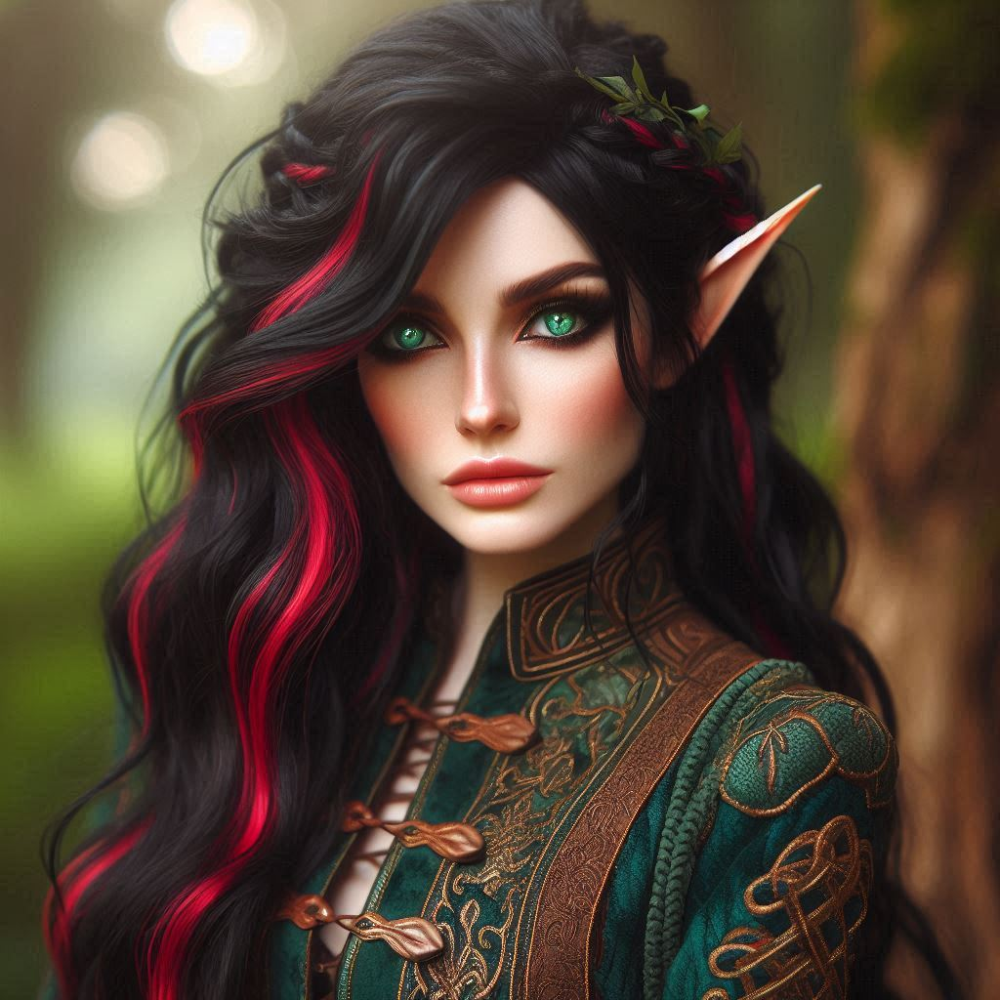

# Maelynn Moonbloom

| Historique            | Description               |
|-----------------------|---------------------------|
| Race                  | Haut-elfe                 |
| Profession            | Barde                     |
| Historique            | Acolyte                   |
| Instruments maîtrisés | Luth, cornemuse, tympanon |

## Aspirations du personnage

- Aller à l'aventure
- Mettre des étoiles dans les yeux des gens !
- Interactions sociales
- Niveau 3 : école de la séduction

## Objectifs d'équipe

- Trouver Ulric dans sa boutique de porcelaine (une couverture) pour lui demander des informations sur la situation en cours.
- Attendre un retour de `bâton noir` quant à la tarrasque
