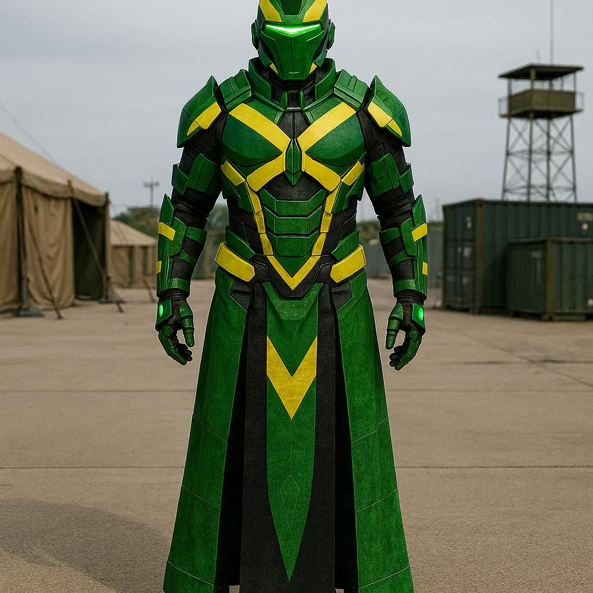

# Melvin "Kibosh" Kelly

> Wah gwaan bradda !

|                                |                                                     |
|--------------------------------|-----------------------------------------------------|
|  |  |

|           |                                                                                                                             |
|-----------|-----------------------------------------------------------------------------------------------------------------------------|
| Archétype | [Membre d'un service secret](https://knight-jdr-systeme.fr/fr/archetype/membre-dun-service-secret/)                         |
| Haut fait | [Conception de la première méta-armure](https://knight-jdr-systeme.fr/fr/great_deed/conception-de-la-premiere-meta-armure/) |
| Blason    | [Serpent](https://knight-jdr-systeme.fr/fr/crest/le-serpent/)                                                               |
| Section   | [Cyclope](https://knight-jdr-systeme.fr/fr/division/cyclope/)                                                               |

## Avantages

### Magnétique - [L'empereur](https://knight-jdr-systeme.fr/fr/arcana/lempereur/)

> Que ce soit par sa gestuelle ou son magnétisme, le héros attire l’attention de tous ceux qu’il croise. De ce fait, il bénéficie d’un bonus d’une réussite automatique à tous ses jets base Aura lorsqu’il interagit avec des personnages humains.

### Esprit d'acier - [L'ermite](https://knight-jdr-systeme.fr/fr/arcana/lermite/)

> Le personnage est habitué à gérer ses émotions seul et sait qu’il peut compter sur lui-même avant toute autre personne. S’il mécanise souvent ses émotions, il résiste mieux à l’Horreur et perd moins facilement espoir. En termes de jeu, lors des pertes de points d’espoir, peu importe leurs sources, le personnage perd toujours 1 point d’espoir de moins que ne l’annoncent le MJ ou les dés.

## Inconvénients

### Fanatique - [Le pape](https://knight-jdr-systeme.fr/fr/arcana/le-pape/)

> Le PJ est un fanatique obtus. Il peut être un fanatique religieux, un intégriste ou simplement un fervent défenseur d’un code moral ou de la loi. Dans tous les cas, en plus d’être têtu, il est prosélyte et n’hésite pas à montrer son adoration. En termes de jeu, cet inconvénient est sujet à l’interprétation de son personnage par le joueur et n’ajoute aucun point de règle. Au joueur de rester en accord avec l’inconvénient et de se sentir capable de jouer un personnage de ce type.

### Sensible à l'anathème ([Section Cyclope](https://knight-jdr-systeme.fr/fr/division/cyclope/))

> Le personnage est curieux de tout ce qui touche à l’Anathème et cette curiosité s’est muée en une étrange fascination. Le chevalier devient, à mesure que les jours passent, plus sensible aux ténèbres. Pour représenter cela, le personnage subit 1D6 supplémentaire lorsqu’il est soumis à la capacité Anathème et tout ennemi tentant de lui appliquer la capacité domination reçoit un bonus de 3 réussites automatiques à son test.

## Armure priest

### Mode nanoC

| Énergie                                                                                                                 | Activation                                        | Durée                                    |
|-------------------------------------------------------------------------------------------------------------------------|---------------------------------------------------|------------------------------------------|
| 3 pour une forme de base / 6 pour un objet détaillé / 9 pour un objet mécanique, de haute technique, informatique, etc. | Action de déplacement, action de combat ou 1 tour | 1 minute ou 10 tours en phase de conflit |

### Mode Mechanic

| Variante   | Énergie | Activation            | Durée       |
|------------|---------|-----------------------|-------------|
| Au contact | 4       | Action de déplacement | Instantanée |
| À distance | 6       | Action de déplacement | Instantanée |

## Modules

### Wingsuit

> Le personnage ne subit plus les dégâts de chute lorsqu’il dépense l’énergie nécessaire à l’activation du module. Lorsque le wingsuit est déployé et que le personnage est en chute, il peut effectuer une action de combat à distance par tour en l’air, en subissant un malus de 2 réussites. De plus, il gagne 2 à son score de réaction tant qu’il est en chute.

| Activation  | Durée                 | Énergie |
|-------------|-----------------------|---------|
| Déplacement | Jusqu'à désactivation | 3       |

### Pod fusées éclairantes

| Activation  | Durée     | Énergie |
|-------------|-----------|---------|
| Déplacement | 1D6 tours | 2       |

| Effet(s)           | Dégâts | Violence | Remarques / Condition            |
|--------------------|--------|----------|----------------------------------|
| Chargeur (3)       | -      | -        |                                  |
| Lumière (2)        | -      | -        |                                  |
| [Malus action] (1) | -      | -        | Humains sans protection aux yeux |
| [Malus action] (2) | -      | -        | Anathème                         |

### Vue alternative: vision magnétique

> Permet de repérer les éléments métalliques à travers les obstacles, annule les malus environnementaux impactant la visibilité lorsqu’il s’agit de repérer ou d’attaquer des choses ou des êtres portant du métal.

| Activation  | Durée                            | Énergie |
|-------------|----------------------------------|---------|
| Déplacement | Une scène / une phase de conflit | 2       |
