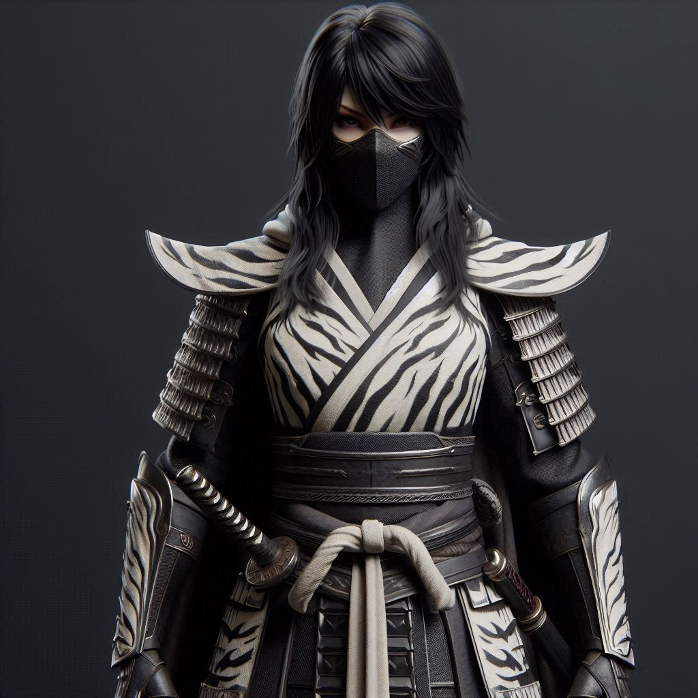

# Shosuro Katsuko

## Objectifs

### Recherches sur le Kolat

Progression ✅✅✅✅✅

5 réussites + 1 aubaine au palais d'émeraude.

### Recherches sur le Kolat - village scorpion

Progression 🔲🔲🔲🔲🔲

Enquêter sur le clan du scorpion dissident (Kolat) -> où est-il ?

### Recherches sur Veneku No Kamiyori

Progression 🔲🔲🔲🔲🔲

### Tai-chi

Progression ✅✅✅✅✅

Art martial non létal spécialisé dans le désarmement et l'immobilisation
Mentor: Shosuro Koharu, au palais d'émeraude
Spécialité : Combat à mains nues

### Vide

Progression 🔲🔲🔲🔲🔲

Augmenter la capacité à ressentir les Kami.

### Enquête sur la mort de mon précédent daimyo

Progression 🔲🔲🔲🔲🔲

Il a été exécuté à tort

### Renforcer l'armure cérémoniale

Progression 🔲🔲🔲🔲🔲

Demander à Kaiu ?
Trouver un autre tigre ?
